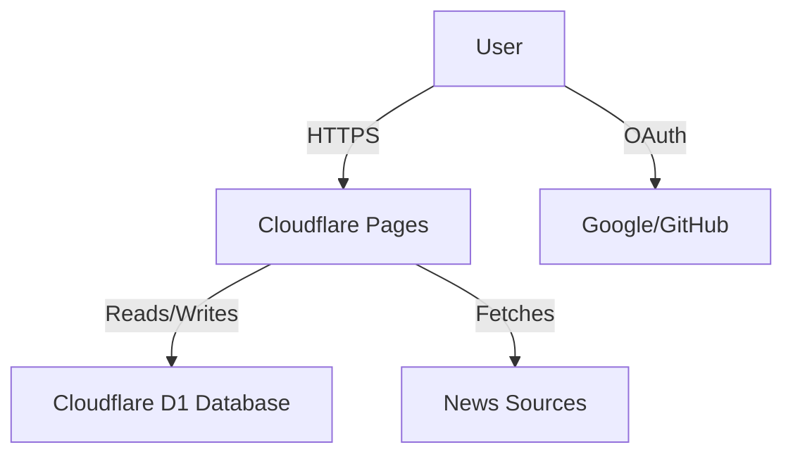

I've always had a specific way of consuming news. I needed to consult my main sources in a consolidated, fast, and simple way, and of course, directly from my mobile device. Most importantly, I wanted an experience completely free of spam and intrusive ads.

Existing solutions didn't quite cut it. They were either too cluttered, missed the specific niche sources I follow, or just didn't feel right. I also needed a reliable way to save articles to read later, without relying on yet another third-party service.

So, I decided to take advantage of this necessity to embrace the "project vibe". I used this opportunity to code the project from scratch, leveraging **[Antigravity](https://antigravity.google/)** to accelerate the process.

The experience was refreshing. Instead of wrestling with complex configurations for hours, I could focus on the selection of data sources and the design. [Antigravity](https://antigravity.google/) helped specifically with the integration parts, analyzing the website HTML structure and generating the scraping logic, which made the development flow much smoother. It felt like pair programming with a partner who handles the tedious parts while I make the executive decisions.

## The App

**[NewsAggr](https://newsaggr.online/)** is the result. It's an elegant, distraction-free news aggregator designed for focus. I'm gradually adding new features and improving existing ones based on feedback from friends. 

It features:
- **Unified Feed**: All my tech and news sources in one place.
- **Read Later**: A simple bookmarking system to save articles for when I have more time.
- **Clean UI**: Dark mode support and a minimalist design that puts content first.
- **Authentication**: OAuth implementation for secure access and syncing across devices.
- **Multi-font**: The app supports multiple fonts to find the one that works best for you.
- **Mobile First**: It's a PWA, so it feels native on my phone.

## Architecture

To keep things fast and low-maintenance, I chose a serverless architecture.

 

The stack is simple but powerful:
- **Cloudflare Pages**: Hosts the frontend and provides the serverless backend (Pages Functions).
- **Cloudflare D1**: A database to store articles and user preferences.
- **Fetching Strategy**: The application uses an **on-demand hydration** model. Data is fetched server-side *during* the user request if the cache is stale, utilizing **adaptive TTLs** to balance freshness with source rate limits. This avoids the cost and complexity of background cron jobs.
- **Authentication**: OAuth implementation with Google and GitHub.

This setup ensures that the app scales effortlessly and stays responsive.

## Conclusion

Building [NewsAggr](https://newsaggr.online/) was a fun journey. It solved a legitimate personal problem while giving me a playground to experiment with new tools like [Antigravity](https://antigravity.google/) and the [Cloudflare](https://www.cloudflare.com/en-gb/) ecosystem. Now, I have my news exactly how I like it: clean, fast, and all in one place.
